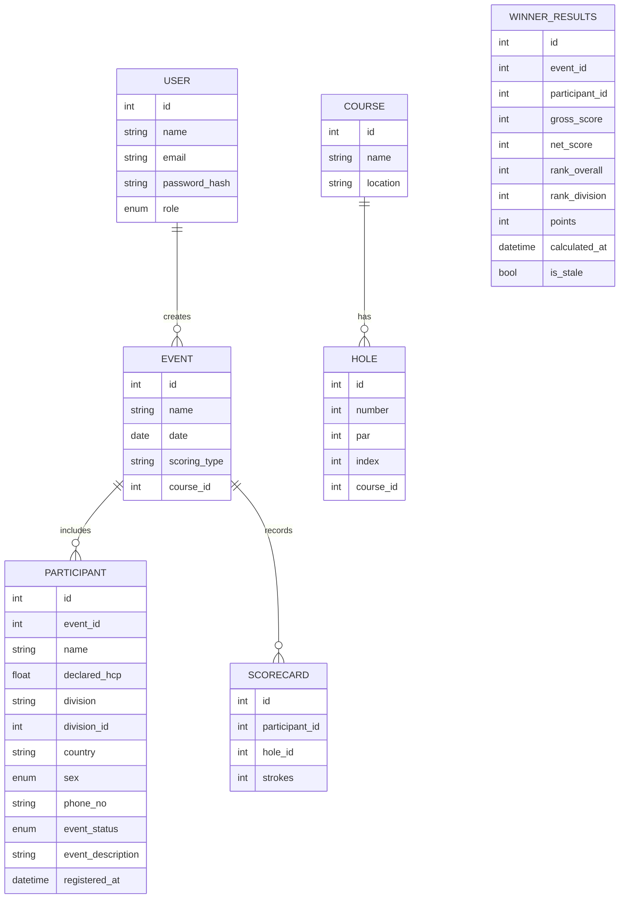

# Abhimata Golf - Product Requirements Document (PRD)

## 1. Overview
**Abhimata Golf** is a web-based tournament scoring application designed for golf event organizers to manage players, courses, and scoring formats including Stroke Play, Net Stroke, System 36, and Stableford. The system will be locally hosted, optimized for tablet and desktop use, and capable of handling up to 150 participants per event.

---

## 2. Objectives
- Simplify score recording and leaderboard management during golf tournaments.
- Support multiple scoring systems.
- Enable real-time leaderboard updates with lightweight infrastructure.
- Provide role-based access control and event-level data isolation.

---

## 3. Target Users

### 3.1 User Roles
| Role | Description | Permissions |
|------|--------------|--------------|
| **Super Admin** | Global admin who manages all users, events, and courses | Full access across system |
| **Event Admin** | Organizes and manages specific tournaments | CRUD access for events, participants, and scoring |
| **Event User** | Enters scores for assigned event(s) | Can record and view event scores only |

### 3.2 Detailed Permission Matrix
| Permission | Super Admin | Event Admin | Event User |
|------------|-------------|-------------|------------|
| Create/Edit Courses | ✓ | ✗ (View only) | ✗ |
| Create Users Manually | ✓ | ✗ | ✗ |
| Create Event Users | ✓ | ✓ | ✗ |
| Access All Events | ✓ | ✓ (own events) | ✗ (assigned only) |
| Manage Participants | ✓ | ✓ | ✓ (assigned event) |
| Input Scorecards | ✓ | ✓ | ✓ (assigned event) |
| View Live Scoring | ✓ | ✓ | ✓ (assigned event) |
| Calculate Winners | ✓ | ✓ | ✗ |
| View Winners Page | ✓ | ✓ | ✗ |

### 3.3 Event-Specific User Creation
- Event Admins can create users specifically for their events
- These users are automatically assigned the EVENT_USER role
- Auto-generated credentials (email and password) are provided
- Users can only access the event they were created for
- Credentials are displayed once and must be saved immediately

---

## 4. Tech Stack
| Layer | Technology | Description |
|--------|-------------|--------------|
| **Frontend** | React (TypeScript) | Component-driven UI framework |
| **Styling** | TailwindCSS + Shadcn/UI | Responsive and modern UI components |
| **Backend** | FastAPI (Python) | Lightweight, high-performance REST API |
| **Database** | SQLite | Embedded database, no external dependency |
| **ORM** | SQLModel / SQLAlchemy | Unified model definition and validation |
| **Auth** | JWT-based | Role-based access control |
| **Export** | Pandas + OpenPyXL | Excel (.xlsx) report generation |

---

## 5. Core Features

### 5.1 Course Management
- Admin can add, update, or delete golf courses.
- Each course contains:
  - Course Name
  - Location
  - Total Holes (default 18)
  - Hole Details (Number, Par, Index)
- Unit for distance: **meters**

### 5.2 User Management
- Super Admin can manage all users manually
- Event Admins can create event-specific users
- User fields:
  - Name
  - Email / Username
  - Password (hashed)
  - Role (Super Admin, Event Admin, Event User)
  - Status (Active / Inactive)

#### 5.2.1 Event-Specific User Creation
- **Access**: Event Admins and Super Admins can create event users
- **Process**: 
  - Click "Add Event User" button in Event Details Quick Actions
  - Provide user's full name (required)
  - Email auto-generated if not provided (format: `event{id}_{name}_{count}@abhimata.local`)
  - Password auto-generated if not provided (12 characters, mixed case, numbers, symbols)
  - User automatically assigned EVENT_USER role
  - UserEvent relationship created with READ_WRITE access level
- **Credentials Display**: 
  - Generated credentials shown once after creation
  - Copy-to-clipboard functionality provided
  - Warning displayed: "Save these credentials - they won't be shown again"
- **Access Control**: 
  - Event users can only access their assigned event
  - Can manage participants, input scorecards, view live scoring
  - Cannot access Winners tab or other events

### 5.3 Event Management
- Event Admin can create and configure tournaments.
- Fields:
  - Event Name
  - Date
  - Location / Course ID
  - Scoring Type (Stroke, Net Stroke, System 36, Stableford)
  - **Event Divisions** (Championship, Senior, Ladies, VIP – with handicap ranges and participant limits)
  - Participant List Upload (.xlsx or CSV)
  - Each participant includes:
    - **Required**: Name, Declared Handicap
    - **Optional**: Division Assignment, Country, Sex (Male/Female), Phone Number, Event Status (Ok/No Show/Disqualified), Event Description

### 5.3.1 Event Division Management ✅ IMPLEMENTED
- **Division Creation**: Create custom divisions with specific criteria
- **Division Configuration**:
  - Division Name (e.g., Championship, Senior, Ladies)
  - Handicap Range (min/max handicap for division)
  - Maximum Participants per division
  - **Teebox Assignment** (NEW - assigns specific teebox to division)
  - Division Description
- **Division Management**:
  - Edit division settings
  - Delete divisions (with participant reassignment)
  - Bulk create multiple divisions
  - View division statistics and participant counts
- **Integration**: Seamlessly integrated with Event Detail Page

#### 5.3.2 Division-Teebox Integration ✅ IMPLEMENTED
**Status**: ✅ IMPLEMENTED
**Implemented**: October 22, 2025

**Description**: Each event division can be assigned a specific teebox (e.g., Blue, White, Red) which determines the course rating and slope rating used for accurate handicap calculations.

**Key Features**:
- Divisions automatically assign teeboxes to all participants in that division
- Teebox selector in Division Manager shows course rating and slope rating
- Course handicap calculated using formula: `(Handicap Index × Slope Rating) / 113`
- Winner calculations use teebox-based course handicap for accurate net scores
- Participants inherit teebox from their division assignment

**Implementation Details**:
- **Database**: EventDivision.teebox_id (FK to Teebox)
- **Models**:
  - `backend/models/event_division.py`: Added teebox relationship
  - `backend/models/course.py`: Teebox model with divisions relationship
  - `backend/models/participant.py`: Added teebox and course_handicap properties
- **API Endpoints**: GET divisions returns teebox data
- **Frontend**: `EventDivisionManager.tsx` includes teebox selector with CR/SR display

**Security Considerations**:
- Authorization: Only Event Admin and Super Admin can assign teeboxes
- Validation: Teebox must belong to event's course

### 5.4 Scoring Input
- Hole-by-hole entry interface with bulk save (all 18 holes at once).
- Accessible to Event Admin and Event User.
- **Stores raw strokes only** - NO calculations performed during score entry.
- Score input validation (numeric, within reasonable range).
- **Optimistic UI Updates**: Score updates instantly without page reload, preserving search filters and user context.
- Real-time WebSocket broadcast on save to update Live Score page.
- **Performance optimized**: Score entry is 5-10x faster without calculation overhead.

### 5.5 Scoring Logic (Winner Page Calculation Only)

**Important**: Calculations are NOT performed during score entry. All calculations happen on Winner Page when Event Admin/Super Admin clicks "Calculate Result" button.

| Type | Formula / Logic |
|------|------------------|
| **Stroke Play** | Total = Sum of strokes. Lowest total wins. |
| **Net Stroke** | Net = Gross − **Course Handicap**. Lowest Net wins. Course Handicap = (Handicap Index × Slope Rating) / 113 |
| **System 36** | Assign points per hole: Birdie = 2, Par = 1, Bogey+ = 0. HCP = 36 − Total Points. Net = Gross − HCP. |
| **Stableford** | Points: 0 (≥Double Bogey), 1 (Bogey), 2 (Par), 3 (Birdie), 4 (Eagle), 5 (Albatross). Highest total points wins. |

**Note**: Course Handicap calculation uses the teebox assigned to participant's division. If no teebox assigned, falls back to declared handicap.

**Tie-breaking Rule**: Countback method (last 9 holes → last 6 → last 3 → last hole).

### 5.6 Live Score Display (Real-time Scorecard View)

**Purpose**: Public display page for tournaments - shows hole-by-hole scores in real-time on TV/projector or web.

**Key Features**:
- **Scorecard Grid Layout**: Displays hole-by-hole raw strokes for each participant (like scoring page, but read-only)
- **No Calculations Shown**: Only raw strokes and declared handicap - no gross/net totals or rankings
- **Real-time Updates**: WebSocket integration for instant score updates when saved
- **Auto-scrolling Carousel**:
  - Automatically scrolls through participants every 5 seconds
  - Pauses when user clicks Previous/Next navigation buttons
  - Shows all participants on single page if they fit (no scrolling needed)
- **Smart Sorting**:
  - Primary: Number of holes completed (descending)
  - Secondary: Gross or Net score (user-selectable toggle) - lowest first
  - Participants with zero scores stay at bottom
- **Responsive Layout**: Auto-fit based on screen size (displays hole-by-hole detail)
- **Full-screen Mode**: Dedicated button for large screen display (TV/projector)
- **Update Indicator**: Shows "Updated X seconds ago" timestamp
- **Score Legend**: Color codes (Eagle=blue, Birdie=green, Par=white, Bogey=yellow, Double+=red)
- **Publicly viewable** without login (read-only endpoint)

**Display Format**:
- Event Name + "Live Score" header
- Score Legend
- Participant scorecards with all 18 holes
- Previous/Next navigation buttons
- Gross/Net sort toggle
- Full-screen button

### 5.7 Winner Page (Calculation & Results Display)

**Purpose**: Public-facing page to display tournament winners in a comprehensive table format.

**Pre-Calculation State**:
- Shows message: "No Winners Yet - Winners need to be calculated before they can be displayed"
- Trophy icon with explanatory text
- Refresh button to reload data

**Calculation Process**:
- **Manual Trigger**: Admin clicks "Calculate Result" button (from Event Detail Page)
- **Progress Indicator**: Shows "Calculating 45/150 scorecards..." with progress bar
- **Batch Processing**: Calculates all participants using Winner Calculation Strategy Pattern
  - **Strategy Selection**: Factory pattern selects appropriate strategy based on event's scoring type
  - **Stroke Play Strategy**: Ranks by gross score (ascending), tie-break by back 9 gross
  - **Net Stroke Strategy**: Ranks by net score (ascending), tie-break by back 9 net
  - **System 36 Strategy**: Ranks by total points (descending - higher wins), tie-break by back 9 points
  - **Stableford Strategy** (future): Ranks by total points (descending), tie-break by back 9 points
  - Rankings per division (top N winners per division based on configuration)
  - Overall rankings (top N overall based on configuration)
  - Special Awards: Best Gross Score, Best Net Score (if enabled in configuration)
  - Tie-breaking using configured method (default: Standard Golf countback)
- **Permanent Storage**: Results stored in database (WinnerResult table)
- **Re-calculation**: If scores updated after calculation, shows warning banner: "Scores updated since last calculation - Recalculate to see latest results"

**Architecture: Winner Calculation Strategy Pattern**:
```
backend/services/winner_strategies/
├── base.py                    # WinnerCalculationStrategy (abstract base)
├── factory.py                 # WinnerStrategyFactory
├── stroke_winner.py           # StrokeWinnerStrategy (gross scoring)
├── net_stroke_winner.py       # NetStrokeWinnerStrategy (net scoring)
└── system36_winner.py         # System36WinnerStrategy (points-based)
```

**Why Strategy Pattern**:
- **Separation of Concerns**: Each scoring type has its own calculation logic
- **Correct Sort Order**: System 36/Stableford use descending (higher wins), Stroke/Net use ascending (lower wins)
- **Extensibility**: Easy to add new scoring types without modifying existing code
- **Consistency**: Mirrors the proven architecture of the scoring system
- **Testability**: Each strategy can be tested independently

**Post-Calculation Display - Multi-Division Table Format**:
- **Comprehensive Table View**: Shows all divisions simultaneously in a single table
- **Table Columns**:
  - Division (sortable)
  - Declared Handicap (sortable)
  - Course Handicap (sortable)
  - Gross Score (sortable)
  - Net Score (sortable)
  - Player Name (sortable)
  - OCB/Tied (tie information)
- **Visual Design**:
  - Teal gradient header with event name
  - Alternating row colors (light blue/blue-100)
  - Sortable column headers with chevron indicators
  - Responsive design for mobile/tablet viewing
- **Data Grouping**: Winners grouped by division, sorted by division rank
- **Footer**: Shows total winners count and number of divisions

**Features**:
- **Sorting**: Click any column header to sort by that field
- **Full Screen**: Toggle button for presentation mode
- **Refresh**: Manual refresh button to reload latest data
- **Responsive**: Optimized for tablet and desktop viewing
- **Public Access**: No authentication required (public tournament results)

**Configuration**:
- Number of winners per division configurable in WinnerConfiguration model
- Default: 3 winners per division
- Tie-breaking: Configurable methods (standard golf countback, etc.)

### 5.8 Reporting & Export
- Export final leaderboard and scorecards to `.xlsx`.
- Include metadata (event name, date, course, scoring type).
- Export winner results with awards and rankings.

### 5.9 Multi-language Support
- English and Bahasa Indonesia.
- Implemented using `react-i18next` (frontend) and FastAPI middleware (backend).

---

## 6. Non-Functional Requirements

| Category | Requirement |
|-----------|--------------|
| **Performance** | Handle up to 150 participants and 20 concurrent users |
| **Scalability** | Migrate to PostgreSQL easily when needed |
| **Availability** | Single-server on-prem deployment |
| **Security** | JWT-based authentication, role-based access control |
| **Maintainability** | Codebase structured in modules (users, events, scoring) |
| **Localization** | English & Bahasa Indonesia supported |
| **Backup** | Manual copy of SQLite `.db` file per event |

---

## 7. Data Model (Simplified)



---

## 8. API Endpoints (High-Level)

| Endpoint | Method | Description | Role |
|-----------|---------|--------------|------|
| `/auth/login` | POST | Login & return JWT | All |
| `/users` | CRUD | Manage users | Super Admin |
| `/users/event/{event_id}/create` | POST | Create event-specific user | Event Admin / Super Admin |
| `/users/event/{event_id}` | GET | Get event users | Event Admin / Super Admin |
| `/courses` | CRUD | Manage courses & holes | Super Admin |
| `/events` | CRUD | Manage tournaments | Event Admin |
| `/events/upcoming` | GET | Get upcoming events (filtered by user access) | All authenticated users |
| `/events/{id}/participants` | POST / GET | Upload or list participants | Event Admin |
| `/scorecards/bulk` | POST | Submit hole-by-hole scores (bulk save all 18 holes) | Event Admin / Event User |
| `/live-score/{event_id}` | GET | View live score display (real-time, public) | Public |
| `/winners/{event_id}/calculate` | POST | Calculate winner results with progress | Event Admin / Super Admin |
| `/winners/{event_id}` | GET | View winner results (public) | Public |
| `/winners/{event_id}/admin` | GET | View winner results (admin) | Event Admin / Super Admin |
| `/export/{event_id}` | GET | Export to Excel | Event Admin |

---

## 9. UI / UX Overview

**Admin Dashboard**
- Quick Actions sidebar with Create Event, Add Course, Manage Users buttons
- Upcoming Events list showing:
  - Event name, date, location (course name)
  - Scoring type and participant count
  - Click to navigate to event details
  - Responsive design (table on desktop, cards on mobile)
- Role-based access control for all dashboard elements

**Score Entry Page**
- Hole-by-hole grid layout (18 holes)
- Bulk save button (saves all 18 holes at once)
- **NO calculations** shown during entry (raw strokes only)
- Submit triggers WebSocket broadcast for live updates

**Live Score Display** (Replaces Leaderboard)
- **Scorecard grid layout** showing hole-by-hole raw strokes
- **Auto-scrolling carousel** (5-second interval) through participants
- **Previous/Next navigation** buttons (pauses auto-scroll)
- **Gross/Net sort toggle** button
- **Full-screen mode** button for TV/projector display
- Score legend with color codes
- "Updated X seconds ago" timestamp
- Real-time WebSocket updates (merged with scroll transitions)
- Responsive auto-fit layout based on screen size
- Publicly accessible without login

**Winner Page** (Multi-Division Table Format)
- **Pre-calculation**: Trophy icon with "No Winners Yet" message and refresh button
- **Post-calculation**: Comprehensive multi-division table display
  - Teal gradient header with event name and subtitle
  - Sortable table columns: Division, Declared Handicap, Course Handicap, Gross, Net, Player Name, OCB/Tied
  - Alternating row colors (light blue/blue-100) for readability
  - Sortable column headers with chevron indicators
  - Footer showing total winners and division count
- **Features**:
  - Full-screen toggle for presentation mode
  - Manual refresh button
  - Responsive design for tablet/desktop
  - Public access (no authentication required)
- **Data Display**: All divisions shown simultaneously, grouped by division, sorted by division rank

**Multilingual Toggle**
- Language switcher (EN / ID) in header

---

## 10. Deployment Plan
- **Local Server Setup:** Python (FastAPI) + SQLite file
- **Frontend:** Build React app → Serve via FastAPI’s static mount or Nginx
- **Startup:** `uvicorn main:app --host 0.0.0.0 --port 8000`
- **Backup:** Copy `.db` file post-event

---

## 11. Migration & Data Management

### 11.1 Existing Data Migration
- **Clear all cached calculations**: Remove LeaderboardCache entries for all existing events
- **Require recalculation**: Event admins must use Winner Page to recalculate results
- **Preserve raw scores**: All existing scorecard strokes remain intact
- **No automatic migration**: Admin decides when to recalculate per event

### 11.2 EventDivision Schema Update
- Add `num_winners` field (integer, default: 3)
- Configures number of winners to display per division on Winner Page
- Editable via EventDivisionManager component

## 12. Future Enhancements
- Multi-day tournament support
- Handicap index calculation (auto from history)
- Offline mode (PWA caching)
- PDF export of scorecards
- Cloud deployment with PostgreSQL
- Additional awards (Longest Drive, Nearest to Pin, etc.)

---

**End of Document**

