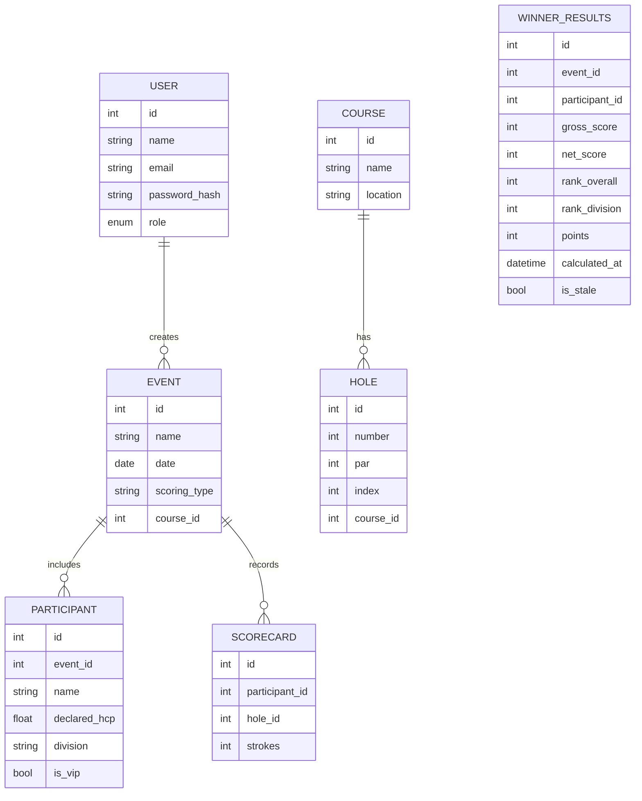

# Abhimata Golf - Product Requirements Document (PRD)

## 1. Overview
**Abhimata Golf** is a web-based tournament scoring application designed for golf event organizers to manage players, courses, and scoring formats including Stroke Play, Net Stroke, System 36, and Stableford. The system will be locally hosted, optimized for tablet and desktop use, and capable of handling up to 150 participants per event.

---

## 2. Objectives
- Simplify score recording and leaderboard management during golf tournaments.
- Support multiple scoring systems.
- Enable real-time leaderboard updates with lightweight infrastructure.
- Provide role-based access control and event-level data isolation.

---

## 3. Target Users
| Role | Description | Permissions |
|------|--------------|--------------|
| **Super Admin** | Global admin who manages all users, events, and courses | Full access across system |
| **Event Admin** | Organizes and manages specific tournaments | CRUD access for events, participants, and scoring |
| **Event User** | Enters scores for assigned event(s) | Can record and view event scores only |

---

## 4. Tech Stack
| Layer | Technology | Description |
|--------|-------------|--------------|
| **Frontend** | React (TypeScript) | Component-driven UI framework |
| **Styling** | TailwindCSS + Shadcn/UI | Responsive and modern UI components |
| **Backend** | FastAPI (Python) | Lightweight, high-performance REST API |
| **Database** | SQLite | Embedded database, no external dependency |
| **ORM** | SQLModel / SQLAlchemy | Unified model definition and validation |
| **Auth** | JWT-based | Role-based access control |
| **Export** | Pandas + OpenPyXL | Excel (.xlsx) report generation |

---

## 5. Core Features

### 5.1 Course Management
- Admin can add, update, or delete golf courses.
- Each course contains:
  - Course Name
  - Location
  - Total Holes (default 18)
  - Hole Details (Number, Par, Index)
- Unit for distance: **meters**

### 5.2 User Management
- Super Admin can manage all users.
- User fields:
  - Name
  - Email / Username
  - Password (hashed)
  - Role (Super Admin, Event Admin, Event User)
  - Status (Active / Inactive)

### 5.3 Event Management
- Event Admin can create and configure tournaments.
- Fields:
  - Event Name
  - Date
  - Location / Course ID
  - Scoring Type (Stroke, Net Stroke, System 36, Stableford)
  - **Event Divisions** (Championship, Senior, Ladies, VIP – with handicap ranges and participant limits)
  - Participant List Upload (.xlsx or CSV)
  - Each participant includes: Name, Declared Handicap, Division Assignment, and VIP flag.

### 5.3.1 Event Division Management ✅ IMPLEMENTED
- **Division Creation**: Create custom divisions with specific criteria
- **Division Configuration**:
  - Division Name (e.g., Championship, Senior, Ladies)
  - Handicap Range (min/max handicap for division)
  - Maximum Participants per division
  - Division Description
- **Division Management**:
  - Edit division settings
  - Delete divisions (with participant reassignment)
  - Bulk create multiple divisions
  - View division statistics and participant counts
- **Integration**: Seamlessly integrated with Event Detail Page

### 5.4 Scoring Input
- Hole-by-hole entry interface with bulk save (all 18 holes at once).
- Accessible to Event Admin and Event User.
- **Stores raw strokes only** - NO calculations performed during score entry.
- Score input validation (numeric, within reasonable range).
- Real-time WebSocket broadcast on save to update Live Score page.
- **Performance optimized**: Score entry is 5-10x faster without calculation overhead.

### 5.5 Scoring Logic (Winner Page Calculation Only)

**Important**: Calculations are NOT performed during score entry. All calculations happen on Winner Page when Event Admin/Super Admin clicks "Calculate Result" button.

| Type | Formula / Logic |
|------|------------------|
| **Stroke Play** | Total = Sum of strokes. Lowest total wins. |
| **Net Stroke** | Net = Gross − Declared Handicap. Lowest Net wins. |
| **System 36** | Assign points per hole: Birdie = 2, Par = 1, Bogey+ = 0. HCP = 36 − Total Points. Net = Gross − HCP. |
| **Stableford** | Points: 0 (≥Double Bogey), 1 (Bogey), 2 (Par), 3 (Birdie), 4 (Eagle), 5 (Albatross). Highest total points wins. |

**Tie-breaking Rule**: Countback method (last 9 holes → last 6 → last 3 → last hole).

### 5.6 Live Score Display (Real-time Scorecard View)

**Purpose**: Public display page for tournaments - shows hole-by-hole scores in real-time on TV/projector or web.

**Key Features**:
- **Scorecard Grid Layout**: Displays hole-by-hole raw strokes for each participant (like scoring page, but read-only)
- **No Calculations Shown**: Only raw strokes and declared handicap - no gross/net totals or rankings
- **Real-time Updates**: WebSocket integration for instant score updates when saved
- **Auto-scrolling Carousel**:
  - Automatically scrolls through participants every 5 seconds
  - Pauses when user clicks Previous/Next navigation buttons
  - Shows all participants on single page if they fit (no scrolling needed)
- **Smart Sorting**:
  - Primary: Number of holes completed (descending)
  - Secondary: Gross or Net score (user-selectable toggle) - lowest first
  - Participants with zero scores stay at bottom
- **Responsive Layout**: Auto-fit based on screen size (displays hole-by-hole detail)
- **Full-screen Mode**: Dedicated button for large screen display (TV/projector)
- **Update Indicator**: Shows "Updated X seconds ago" timestamp
- **Score Legend**: Color codes (Eagle=blue, Birdie=green, Par=white, Bogey=yellow, Double+=red)
- **Publicly viewable** without login (read-only endpoint)

**Display Format**:
- Event Name + "Live Score" header
- Score Legend
- Participant scorecards with all 18 holes
- Previous/Next navigation buttons
- Gross/Net sort toggle
- Full-screen button

### 5.7 Winner Page (Calculation & Results Display)

**Purpose**: Admin-only page to calculate final results and display winners.

**Pre-Calculation State**:
- Shows message: "No results yet - Click 'Calculate Result' to determine winners"
- "Calculate Result" button (accessible by Super Admin and Event Admin only)

**Calculation Process**:
- **Manual Trigger**: Admin clicks "Calculate Result" button
- **Progress Indicator**: Shows "Calculating 45/150 scorecards..." with progress bar
- **Batch Processing**: Calculates all participants using Strategy Pattern
  - Gross scores (sum of all strokes)
  - Net scores (gross - declared handicap, respecting scoring type)
  - Rankings per division
  - Overall rankings
  - Tie-breaking using countback (last 9 → last 6 → last 3 → last hole)
- **Permanent Storage**: Results stored in database (LeaderboardCache or WinnerResults table)
- **Re-calculation**: If scores updated after calculation, shows warning banner: "Scores updated since last calculation - Recalculate to see latest results"

**Post-Calculation Display**:
- **Overall Awards**:
  - Best Gross (single winner across all divisions)
  - Best Net (single winner across all divisions)
- **Division Winners**:
  - Top 3 per division with podium display (1st, 2nd, 3rd)
  - Configurable number of winners per division (EventDivision.num_winners field)
- **Award Display**:
  - Participant Name
  - Division
  - Gross Score
  - Net Score
  - System 36 Points (if applicable)
  - Rank with tie indicator

**Configuration**:
- Number of winners per division configurable in EventDivision model
- Default: 3 winners per division
- Tie-breaking: Automatic countback method

### 5.8 Reporting & Export
- Export final leaderboard and scorecards to `.xlsx`.
- Include metadata (event name, date, course, scoring type).
- Export winner results with awards and rankings.

### 5.9 Multi-language Support
- English and Bahasa Indonesia.
- Implemented using `react-i18next` (frontend) and FastAPI middleware (backend).

---

## 6. Non-Functional Requirements

| Category | Requirement |
|-----------|--------------|
| **Performance** | Handle up to 150 participants and 20 concurrent users |
| **Scalability** | Migrate to PostgreSQL easily when needed |
| **Availability** | Single-server on-prem deployment |
| **Security** | JWT-based authentication, role-based access control |
| **Maintainability** | Codebase structured in modules (users, events, scoring) |
| **Localization** | English & Bahasa Indonesia supported |
| **Backup** | Manual copy of SQLite `.db` file per event |

---

## 7. Data Model (Simplified)

---

## 8. API Endpoints (High-Level)

| Endpoint | Method | Description | Role |
|-----------|---------|--------------|------|
| `/auth/login` | POST | Login & return JWT | All |
| `/users` | CRUD | Manage users | Super Admin |
| `/courses` | CRUD | Manage courses & holes | Super Admin |
| `/events` | CRUD | Manage tournaments | Event Admin |
| `/events/{id}/participants` | POST / GET | Upload or list participants | Event Admin |
| `/scorecards/bulk` | POST | Submit hole-by-hole scores (bulk save all 18 holes) | Event Admin / Event User |
| `/live-score/{event_id}` | GET | View live score display (real-time, public) | Public |
| `/winners/{event_id}/calculate` | POST | Calculate winner results with progress | Event Admin / Super Admin |
| `/winners/{event_id}` | GET | View winner results | Event Admin / Super Admin |
| `/export/{event_id}` | GET | Export to Excel | Event Admin |

---

## 9. UI / UX Overview

**Admin Dashboard**
- Manage Courses, Events, Users
- Event Setup Wizard

**Score Entry Page**
- Hole-by-hole grid layout (18 holes)
- Bulk save button (saves all 18 holes at once)
- **NO calculations** shown during entry (raw strokes only)
- Submit triggers WebSocket broadcast for live updates

**Live Score Display** (Replaces Leaderboard)
- **Scorecard grid layout** showing hole-by-hole raw strokes
- **Auto-scrolling carousel** (5-second interval) through participants
- **Previous/Next navigation** buttons (pauses auto-scroll)
- **Gross/Net sort toggle** button
- **Full-screen mode** button for TV/projector display
- Score legend with color codes
- "Updated X seconds ago" timestamp
- Real-time WebSocket updates (merged with scroll transitions)
- Responsive auto-fit layout based on screen size
- Publicly accessible without login

**Winner Page** (New)
- **Pre-calculation**: "Calculate Result" button with instructions
- **During calculation**: Progress bar ("Calculating 45/150 scorecards...")
- **Post-calculation**:
  - Best Gross and Best Net awards (overall)
  - Top 3 per division with podium display
  - Warning banner if scores updated after calculation
  - Re-calculate button
- Accessible by Event Admin and Super Admin only

**Multilingual Toggle**
- Language switcher (EN / ID) in header

---

## 10. Deployment Plan
- **Local Server Setup:** Python (FastAPI) + SQLite file
- **Frontend:** Build React app → Serve via FastAPI’s static mount or Nginx
- **Startup:** `uvicorn main:app --host 0.0.0.0 --port 8000`
- **Backup:** Copy `.db` file post-event

---

## 11. Migration & Data Management

### 11.1 Existing Data Migration
- **Clear all cached calculations**: Remove LeaderboardCache entries for all existing events
- **Require recalculation**: Event admins must use Winner Page to recalculate results
- **Preserve raw scores**: All existing scorecard strokes remain intact
- **No automatic migration**: Admin decides when to recalculate per event

### 11.2 EventDivision Schema Update
- Add `num_winners` field (integer, default: 3)
- Configures number of winners to display per division on Winner Page
- Editable via EventDivisionManager component

## 12. Future Enhancements
- Multi-day tournament support
- Handicap index calculation (auto from history)
- Offline mode (PWA caching)
- PDF export of scorecards
- Cloud deployment with PostgreSQL
- Additional awards (Longest Drive, Nearest to Pin, etc.)

---

**End of Document**

