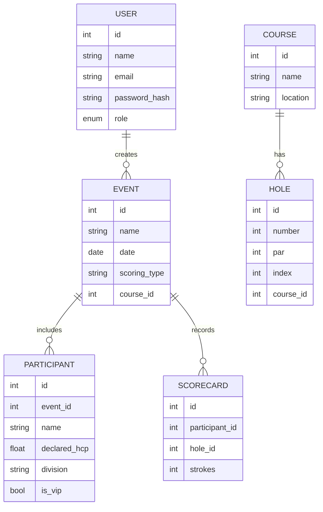

# Abhimata Golf - Product Requirements Document (PRD)

## 1. Overview
**Abhimata Golf** is a web-based tournament scoring application designed for golf event organizers to manage players, courses, and scoring formats including Stroke Play, Net Stroke, System 36, and Stableford. The system will be locally hosted, optimized for tablet and desktop use, and capable of handling up to 150 participants per event.

---

## 2. Objectives
- Simplify score recording and leaderboard management during golf tournaments.
- Support multiple scoring systems.
- Enable real-time leaderboard updates with lightweight infrastructure.
- Provide role-based access control and event-level data isolation.

---

## 3. Target Users
| Role | Description | Permissions |
|------|--------------|--------------|
| **Super Admin** | Global admin who manages all users, events, and courses | Full access across system |
| **Event Admin** | Organizes and manages specific tournaments | CRUD access for events, participants, and scoring |
| **Event User** | Enters scores for assigned event(s) | Can record and view event scores only |

---

## 4. Tech Stack
| Layer | Technology | Description |
|--------|-------------|--------------|
| **Frontend** | React (TypeScript) | Component-driven UI framework |
| **Styling** | TailwindCSS + Shadcn/UI | Responsive and modern UI components |
| **Backend** | FastAPI (Python) | Lightweight, high-performance REST API |
| **Database** | SQLite | Embedded database, no external dependency |
| **ORM** | SQLModel / SQLAlchemy | Unified model definition and validation |
| **Auth** | JWT-based | Role-based access control |
| **Export** | Pandas + OpenPyXL | Excel (.xlsx) report generation |

---

## 5. Core Features

### 5.1 Course Management
- Admin can add, update, or delete golf courses.
- Each course contains:
  - Course Name
  - Location
  - Total Holes (default 18)
  - Hole Details (Number, Par, Index)
- Unit for distance: **meters**

### 5.2 User Management
- Super Admin can manage all users.
- User fields:
  - Name
  - Email / Username
  - Password (hashed)
  - Role (Super Admin, Event Admin, Event User)
  - Status (Active / Inactive)

### 5.3 Event Management
- Event Admin can create and configure tournaments.
- Fields:
  - Event Name
  - Date
  - Location / Course ID
  - Scoring Type (Stroke, Net Stroke, System 36, Stableford)
  - **Event Divisions** (Championship, Senior, Ladies, VIP – with handicap ranges and participant limits)
  - Participant List Upload (.xlsx or CSV)
  - Each participant includes: Name, Declared Handicap, Division Assignment, and VIP flag.

### 5.3.1 Event Division Management ✅ IMPLEMENTED
- **Division Creation**: Create custom divisions with specific criteria
- **Division Configuration**:
  - Division Name (e.g., Championship, Senior, Ladies)
  - Handicap Range (min/max handicap for division)
  - Maximum Participants per division
  - Division Description
- **Division Management**:
  - Edit division settings
  - Delete divisions (with participant reassignment)
  - Bulk create multiple divisions
  - View division statistics and participant counts
- **Integration**: Seamlessly integrated with Event Detail Page

### 5.4 Scoring Input
- Hole-by-hole entry interface.
- Accessible to Event Admin and Event User.
- Supports auto-calculation of total strokes and derived scores based on scoring type.
- Score input validation (numeric, within reasonable range).

### 5.5 Scoring Logic

| Type | Formula / Logic |
|------|------------------|
| **Stroke Play** | Total = Sum of strokes. Lowest total wins. Tie → Match play. |
| **Net Stroke** | Net = Gross − Declared Handicap. Lowest Net wins. |
| **System 36** | Assign points per hole: Birdie = 2, Par = 1, Bogey+ = 0. HCP = 36 − Total Points. Net = Gross − HCP. |
| **Stableford** | Points: 0 (≥Double Bogey), 1 (Bogey), 2 (Par), 3 (Birdie), 4 (Eagle), 5 (Albatross). Highest total points wins. |

### 5.6 Live Scoring & Leaderboard
- Auto-refresh leaderboard (polling every 10–15s).
- Displays:
  - Player Name
  - Gross Score
  - Net Score / Points
  - Division
  - Rank
- Publicly viewable without login (read-only endpoint).

### 5.7 Winner Page
- Display per division.
- Awards:
  - Best Gross
  - Best Net
- Handles ties using countback rule (last 9 → last 6 → last 3 → last hole).

### 5.8 Reporting & Export
- Export final leaderboard and scorecards to `.xlsx`.
- Include metadata (event name, date, course, scoring type).

### 5.9 Multi-language Support
- English and Bahasa Indonesia.
- Implemented using `react-i18next` (frontend) and FastAPI middleware (backend).

---

## 6. Non-Functional Requirements

| Category | Requirement |
|-----------|--------------|
| **Performance** | Handle up to 150 participants and 20 concurrent users |
| **Scalability** | Migrate to PostgreSQL easily when needed |
| **Availability** | Single-server on-prem deployment |
| **Security** | JWT-based authentication, role-based access control |
| **Maintainability** | Codebase structured in modules (users, events, scoring) |
| **Localization** | English & Bahasa Indonesia supported |
| **Backup** | Manual copy of SQLite `.db` file per event |

---

## 7. Data Model (Simplified)

---

## 8. API Endpoints (High-Level)

| Endpoint | Method | Description | Role |
|-----------|---------|--------------|------|
| `/auth/login` | POST | Login & return JWT | All |
| `/users` | CRUD | Manage users | Super Admin |
| `/courses` | CRUD | Manage courses & holes | Super Admin |
| `/events` | CRUD | Manage tournaments | Event Admin |
| `/events/{id}/participants` | POST / GET | Upload or list participants | Event Admin |
| `/scores` | POST / PUT | Submit hole-by-hole scores | Event Admin / Event User |
| `/leaderboard/{event_id}` | GET | View leaderboard | Public |
| `/export/{event_id}` | GET | Export to Excel | Event Admin |

---

## 9. UI / UX Overview

**Admin Dashboard**
- Manage Courses, Events, Users
- Event Setup Wizard

**Score Entry Page**
- Hole-by-hole grid layout (18 holes)
- Auto-total calculation
- Submit button with confirmation prompt

**Leaderboard**
- Responsive table
- Columns: Player | Division | Gross | Net | Points | Rank
- Auto-refresh every 10–15 seconds

**Winner Page**
- Division filter
- Highlight winners visually

**Multilingual Toggle**
- Language switcher (EN / ID) in header

---

## 10. Deployment Plan
- **Local Server Setup:** Python (FastAPI) + SQLite file
- **Frontend:** Build React app → Serve via FastAPI’s static mount or Nginx
- **Startup:** `uvicorn main:app --host 0.0.0.0 --port 8000`
- **Backup:** Copy `.db` file post-event

---

## 11. Future Enhancements
- Multi-day tournament support
- Handicap index calculation (auto from history)
- Offline mode (PWA caching)
- Real-time push via WebSocket / Socket.IO
- PDF export of scorecards
- Cloud deployment with PostgreSQL

---

**End of Document**

